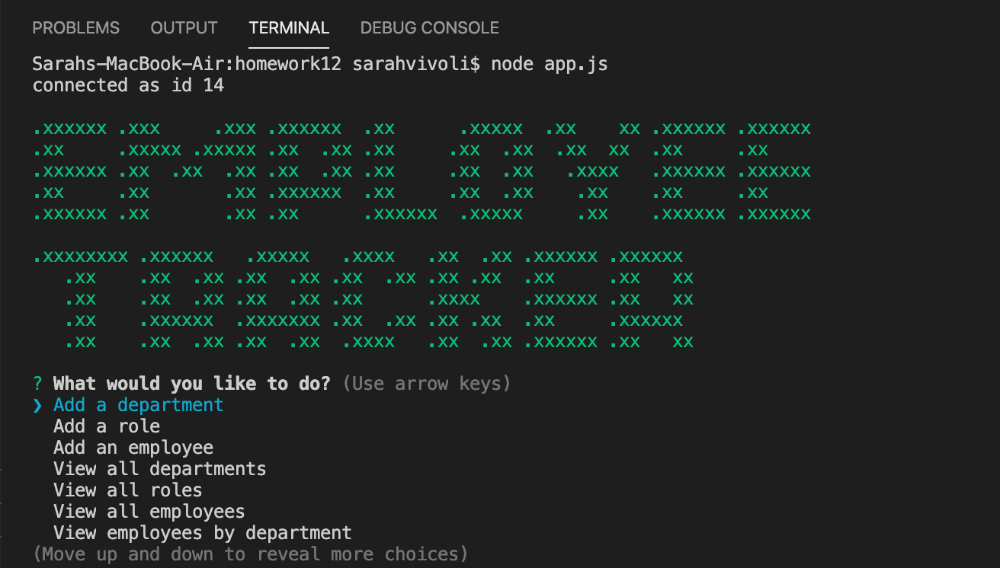
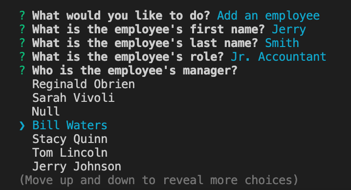
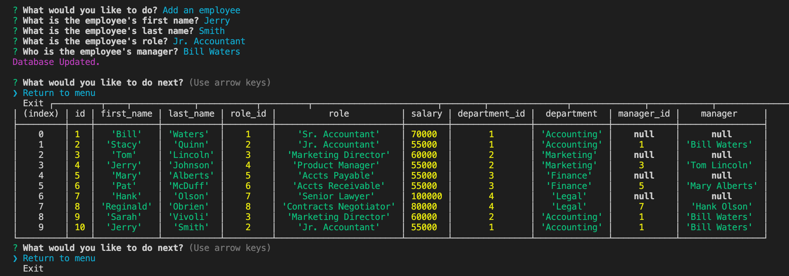
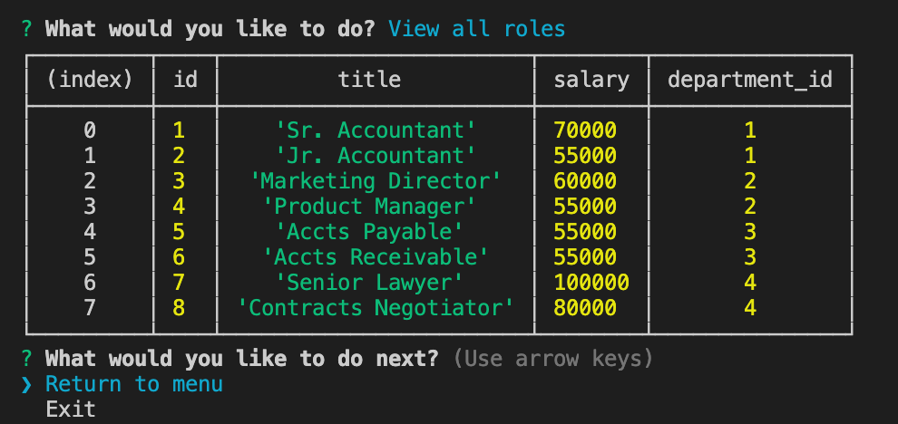
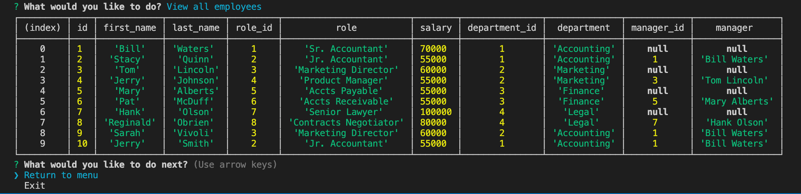
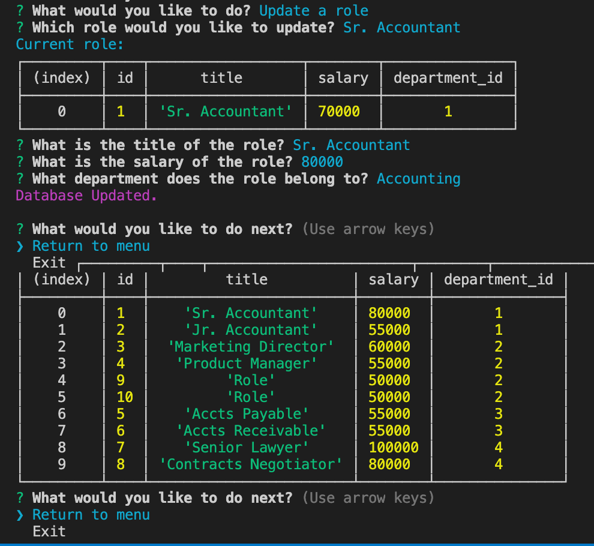
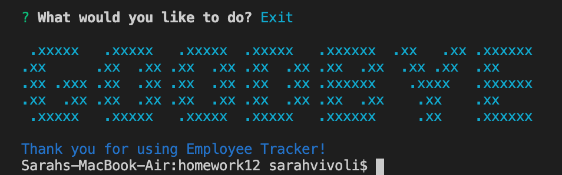
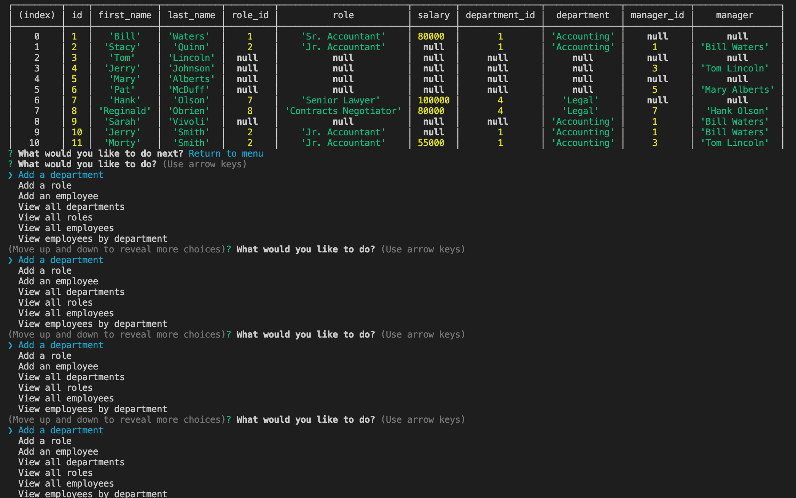

# Employee-Tracker

## Links to project

[GitHub Repository](https://github.com/svivoli/Employee-Tracker)

## Instructions

// Update password
- In the 'app.js' file change the password on line 15 to your MySQL password.  
  
// Initialize database in MySQL  
Method 1:  
- With Terminal pointing toward the project's directory, input the following command:
```sh
mysql -u root -p schema.sql
```
- Enter your MySQL password when prompted.
- Input the following command:
```sh
mysql -u root -p seeds.sql
```
- Enter your MySQL password when prompted.  
The database should now be loaded in MySQL.   
  
Method 2:  
- Copy the contents of the 'schema.sql' file and paste them into a new query in MySQL.
- Run the query.
- Copy the contents of the 'seeds.sql' file and paste them into MySQL.
- Run the query.  
The database should now be loaded in MySQL.  
  
// Run the application  
- With Terminal pointing toward the project's directory, input the following command:
```sh
node app.js
```
- A menu of options will appear after the question "What would you like to do?". Use the arrow keys to scroll through the options and press enter once you have selected one.
- For menu options that prompt you for information, type or select your answer and press enter. Other options may simply display tables and information.
* A short menu appears after each operation through which you can select to return to the menu or exit.  
- Share and Enjoy!

## Description

A command-line application that allows users to track employee information. The user is able to view, add, delete, and update data from the command line by selecting from various menu options. This is a useful organizational tool for employees as they can easily track and make changes to an important database of company information.

### Node Modules

1. MySQL
2. Inqurier
3. Chalk

### Application Components

1. Fancy console title upon app start and exit
2. 15 menu options
- Add department, role, employee
- View departments, roles, employees, employees by department, employees by manager
- Update role, employee's manager, employee
- View the total utilized budget of a department (combined salaries)
- Delete department, role, employee
3. Prompts
4. Console.table used to display tables

## User Experience



After running node app.js, the user is greeted with a large title and a main menu where they can select an action. The action types include updating, adding, viewing, and deleting. The user may also exit the menu/application.



When adding an employee the user is prompted for the employees name, role, and manager.

 

Once the user inputs the data, the user receives a message confirming the database has been updated and the corresponding table is displayed to reflect the changes made. The user receives the same output when performing deletions.



When viewing all roles a table of all roles and their corresponding salaries and ids is displayed.

 

When viewing all employees a table of all roles and their corresponding roles, salaries, departments, managers, and ids is displayed.



When updating an entry, the user is asked which entry they want to update, after which a table displaying the current state of that entry is rendered. Next, the user is asked questions pertaining to the details of the role. If any of the data points should remain the same, the user should simply enter the same values. Once they have answered all questions, a table is displayed to reflect the changes made to the entry. 



The user may exit the application after performing each action, or from the main menu. Upon doing so, a goodbye title and a thank you message are displayed.

## Bugs

There is an apparent memory leak that causes disruptions in the application. Messages/menus will display multiple times and overlap one another. You can see some evidence of this in some of the images in the user experience section. Below is a more durastic example.



## Developer Experience

I found this project to be involved but it came easily after my exposure to MySQL in class. The code is a bit lengthy and some functions have nested queries that seem cumbersome and less than concise. I would like to try rebuilding the application using promises to see if the code would be a little cleaner. The memory leak issue is devastating to the functionality of the app, and I will be working to get it resolved in the future. Issues aside, a fun project that showcases the functionality of command-line applications and node.

--Sarah Vivoli
